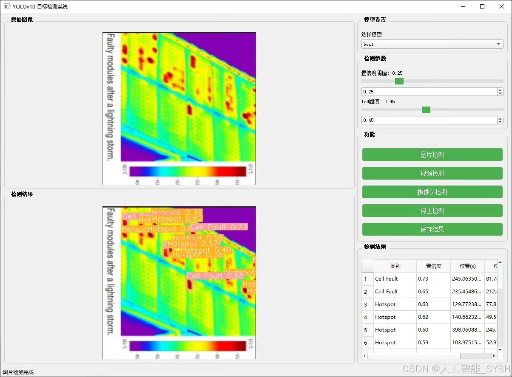
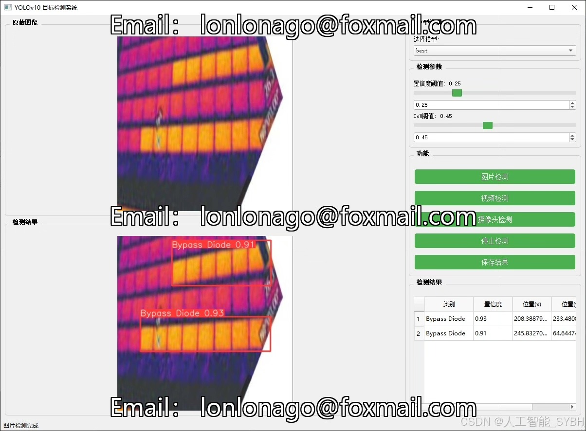
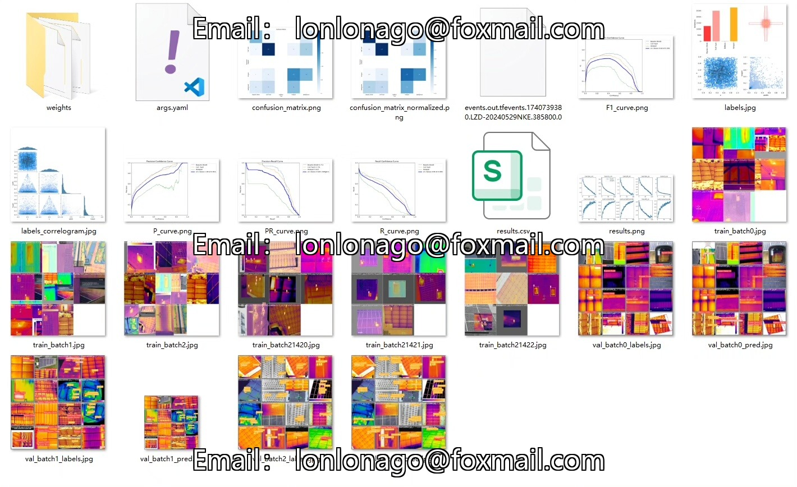
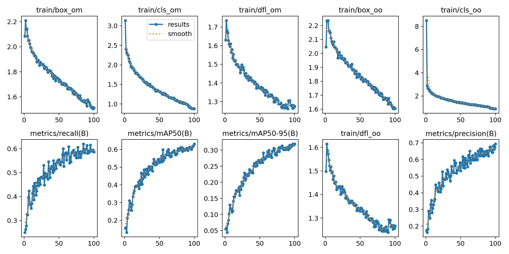
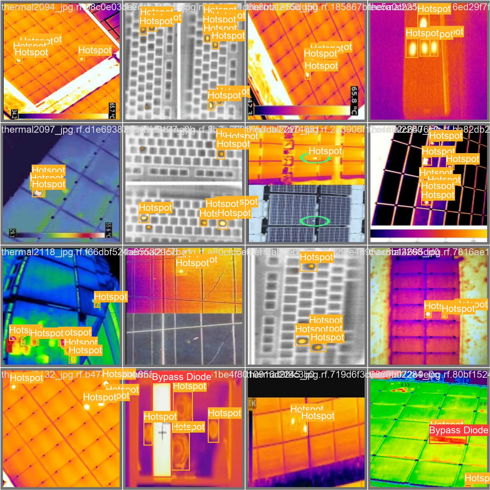
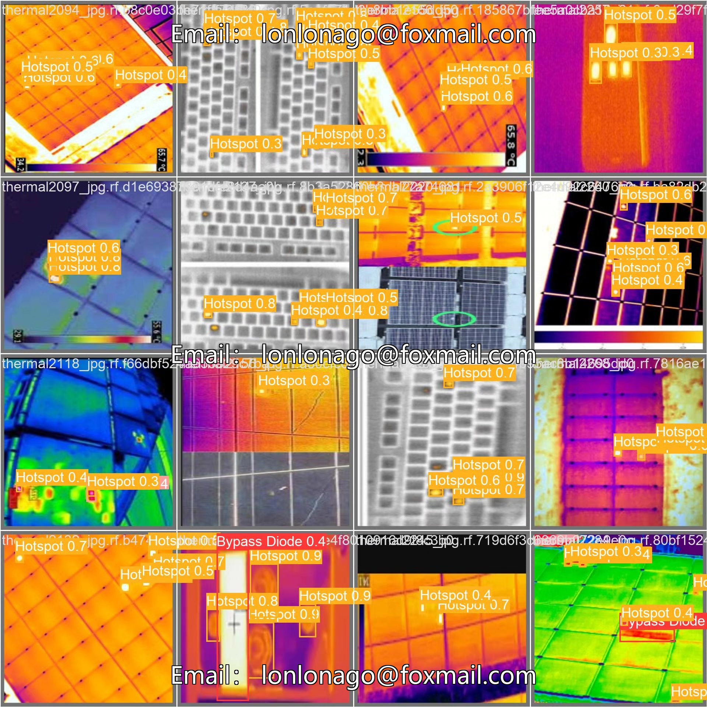
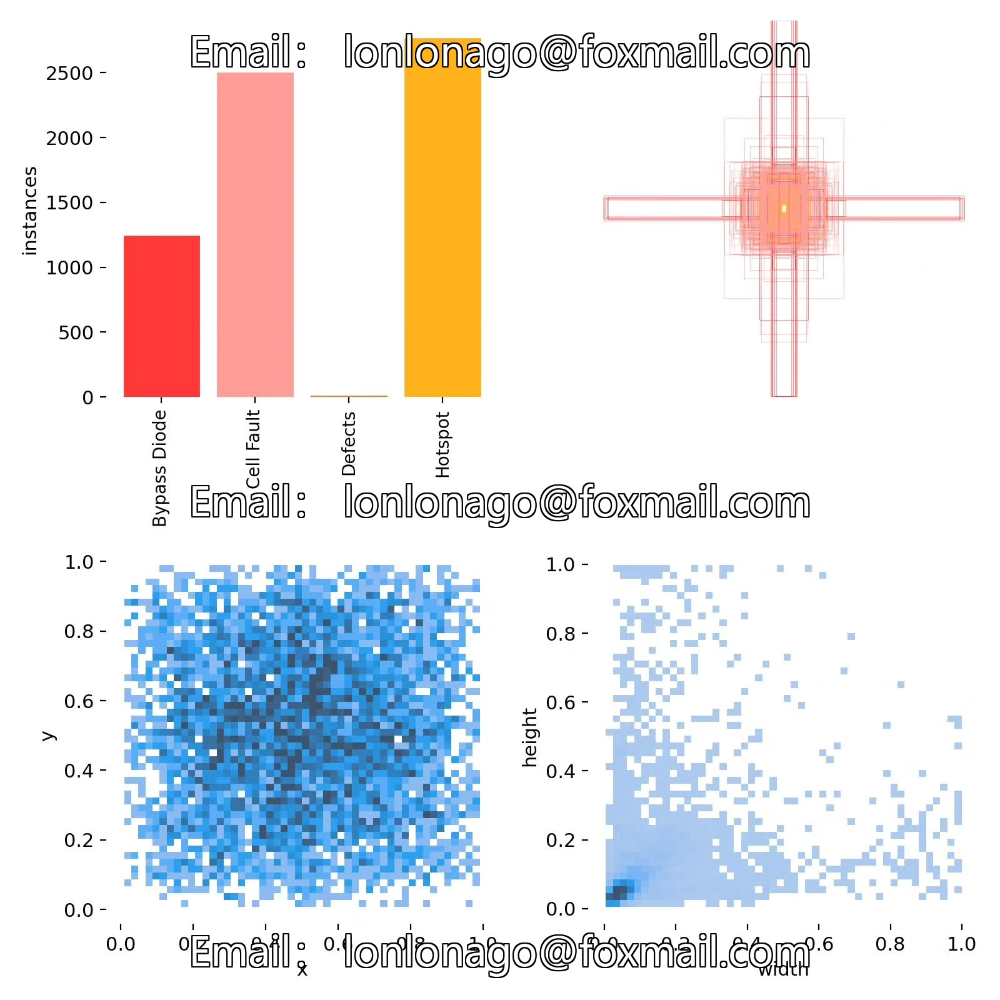
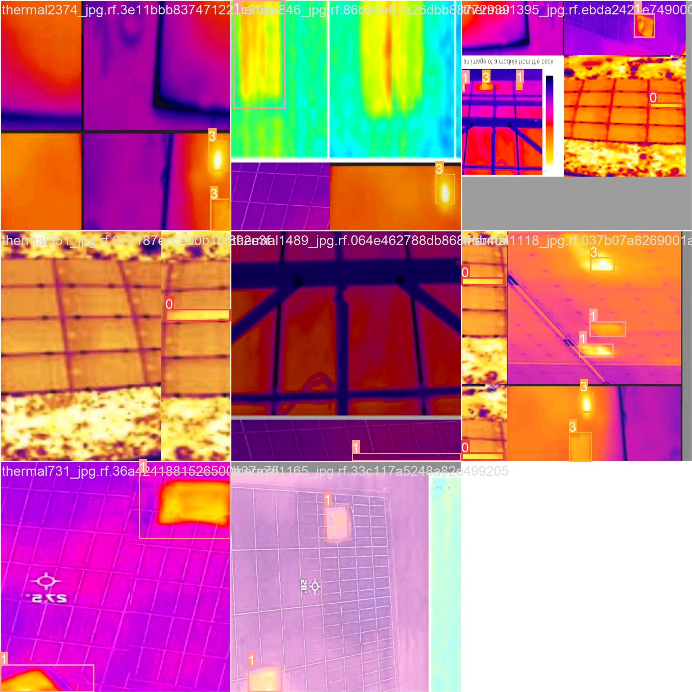

# Based on deep learning YOLOv10 for infrared solar panel defect detection system (YOL

## Body

Based on deep learning YOLOv10, an infrared solar panel defect detection system (YOLOv10+YOLO dataset + UI interface + Python project source code + model)

Solar panels, as an important component of clean energy, their performance and lifespan directly affect the efficiency of energy conversion. However, during manufacturing and usage, solar panels may encounter various defects such as bypass diode failure (Bypass Diode), cell fault (Cell Fault), defect areas (Defects), and hotspots (Hotspot). These defects not only reduce the power generation efficiency of solar panels but also may lead to safety hazards.

The company's products have obtained the official commercial license certification from YOLO.

We provide after-sales service.

After payment, we will provide WeChat ID for any questions.

Environmental configuration: We will provide a tutorial on environmental configuration, and WeChat will provide答疑.

Remote installation service: If you need remote configuration, an additional fee of 69 is required.
If the configuration fails, all fees will be refunded (specially for older computers, only the installation fee will be refunded).

Retraining dataset: After configuring the environment, you can train on your own computer.
If you need us to retrain, just pay 69 plus computing power fees (2.5 yuan/hour).

Full package of after-sales service

## Images

## Payment

Here is a pay link on Stripe ( https://buy.stripe.com/3cs8yP7sY87d0vu9AB ). Please contact me lonlonago@foxmail.com after funding $89, and I will send you a complete data files , thank you!

